<h1 align="center"><a href="https://galetos-orderapp-pp4-1411404b0904.herokuapp.com/" target="_blank">Thunder Nutrition</a></h1> 

Introducing Thunder Nutrition an e-commerce platform is the culmination of my journey in Full Stack Web Development, developed using Python and Django. With Thunder Nutrition, I've combined my passion for fitness with cutting-edge technology to provide customers with a seamless shopping experience. From top-tier supplements to premium equipment, every product is meticulously curated to meet the needs of athletes and fitness enthusiasts.

[**Link to Thunder Nutrition App Live **](https://thunder-nutrition-6bac86cc4153.herokuapp.com/)

# Contents

- [Contents](#contents)
  - [User Experience (UX)](#user-experience-ux)
    - [User Stories](#user-stories)
  - [Features](#features)
    - [Landing Page](#landing-page)
    - [Produts](#products)
    - [Product Details](#product-details)
    - [Log In](#log-in)
    - [Shopping Cart](#shopping-cart)
    - [Messages](#messages)
    - [Checkout Page](#checkout-page)
    - [Checkout Success](#checkout-success)
    - [Add Product](#add-product)
    - [Edit Products](#edit-products)
    - [Profile Page](#profile-page)
    - [Future Features](#future-features)
  - [Testing](#testing)
    - [Bugs and Issues](#bugs-and-issues)
  - [Technologies Used](#technologies-used)
  - [Deployment](#deployment)
  - [Credits](#credits)
    - [Content](#content)
    - [Media](#media)
  - [Acknowledgments](#acknowledgments)
- [THANK YOU!](#thank-you)

___

## User Experience (UX)

  ### User Stories

User stories were written and recorded using the Kanban and Issue tool from GitHub that can be found in [**here**](https://github.com/Cesargarciajr/ecomerce-thunder-pp5/issues)

  [Back to top](<#contents>)
  
   - ### Agile and Kanban
GitHub Project Boards and Kanban are instrumental in collaborative project management. Using Kanban methodology, tasks move through stages like "To do," "In progress," "Testing," and "Done," providing a visual representation and limiting work in progress.

   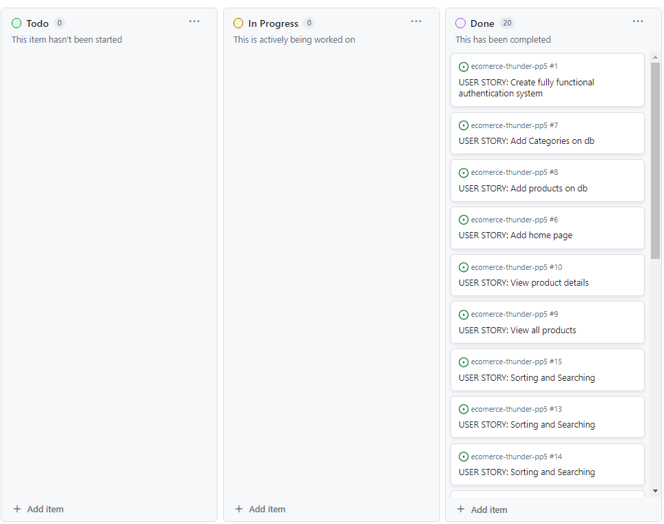

[Back to top](<#contents>)

  - ### FlowChart
    The flowchart was a very useful tool to plan ahead the models and understand how to build the application below you can see the chart that was made using the [**Lucid**](https://lucid.co/)

    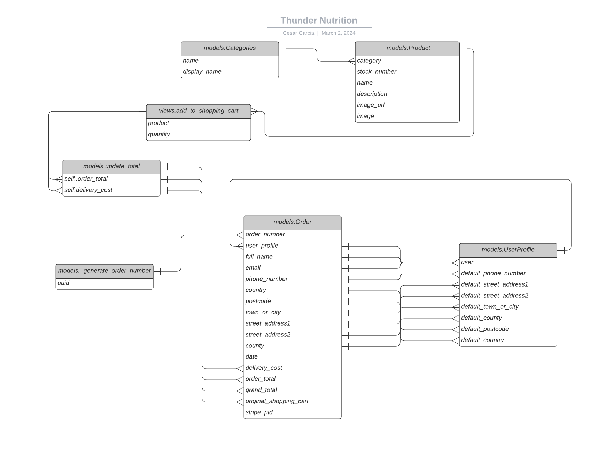

[Back to top](<#contents>)

  - ### Design Choices
      The idea was to build a a simple "app-based" design with smooth transitions to make the UX even more seamless and intuitive. All the colors and styles were applied with the built in classes provided that can be found on the [**Bootstrap**](https://getbootstrap.com/) documentation.

    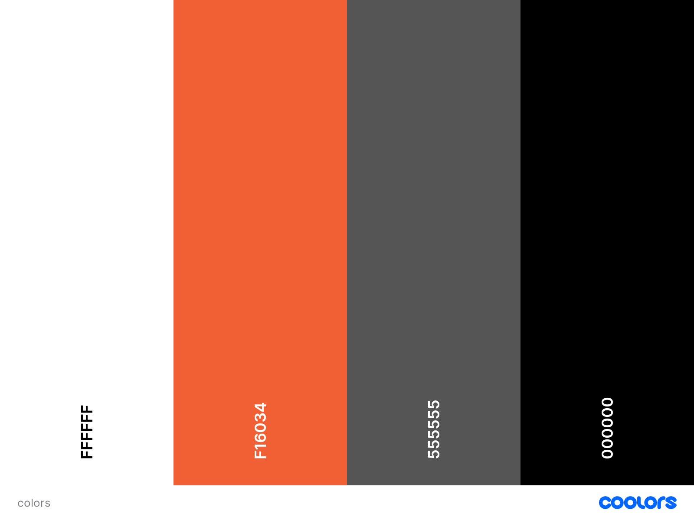

  - ### Wireframes
      wireframes was designed on [**Balsamiq**]([https://lucid.co/](https://balsamiq.cloud/))

    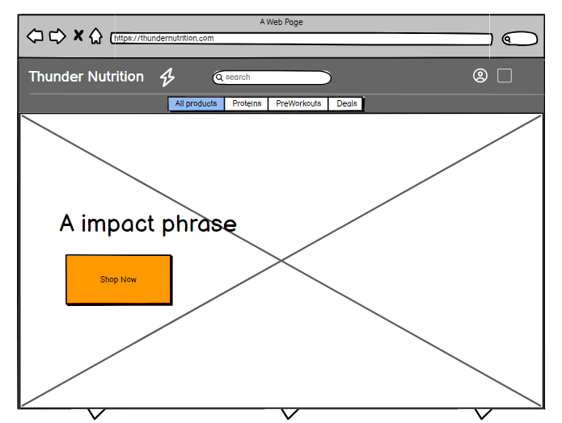
    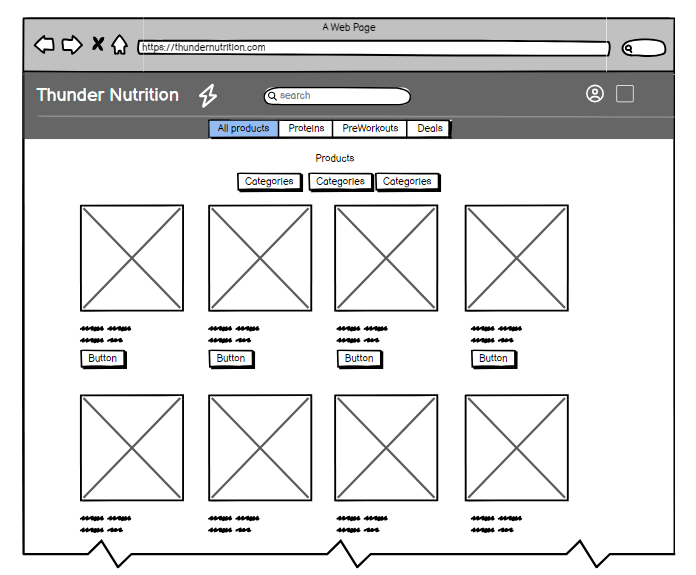    
    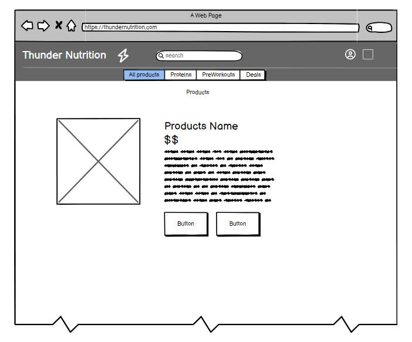
        
    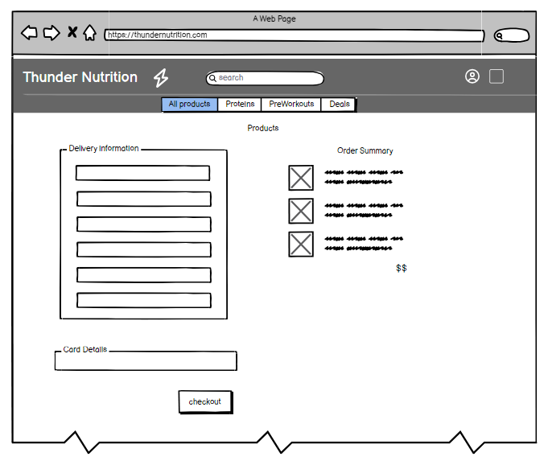
    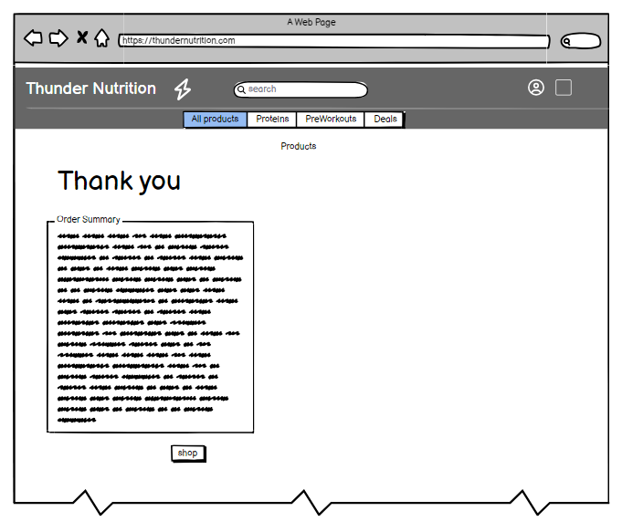

[Back to top](<#contents>)

## Features

  ### Landing Page
Landing page was design to look like a simple with a intuitive button to go straight to shopping

   

[Back to top](<#contents>)

  ### Products
Products page showing products clear and shortcut button to add to cart

  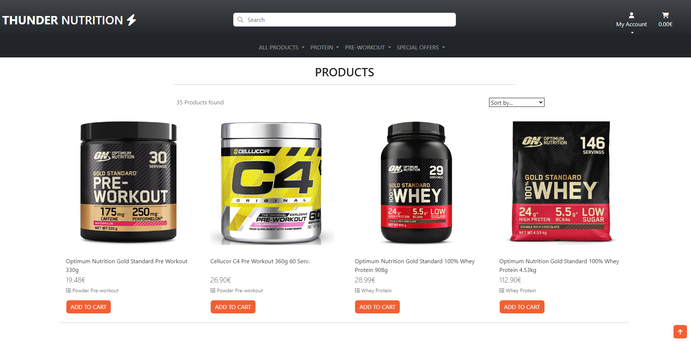 
  
[Back to top](<#contents>)
        
  ### Product Details
Product Detail page showing products price, description and button to add to cart

  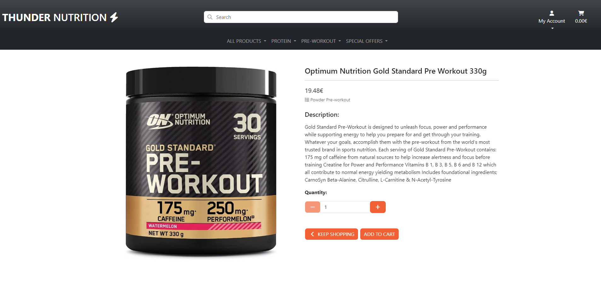 

[Back to top](<#contents>)

  ### Log In
Once the user choose the options new order he will be redirect to a login page that has instructions if the user does not have an account yet

  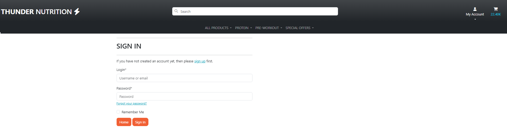 
 
[Back to top](<#contents>)

  ### Shopping Cart
Shopping cart gives the user hability to edit the cart, update quantity or delete product as well shows the user total and delivery cost

  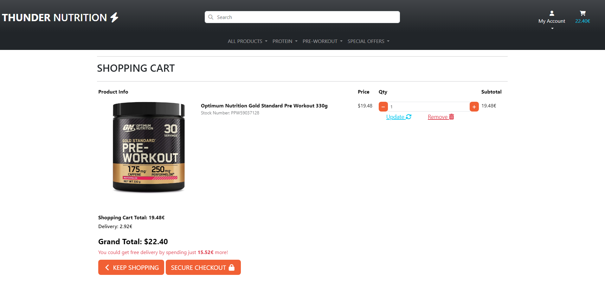 
 
[Back to top](<#contents>)

  ### Messages
As use add products to cart a message with a preview of the shopping cart will be displayed

  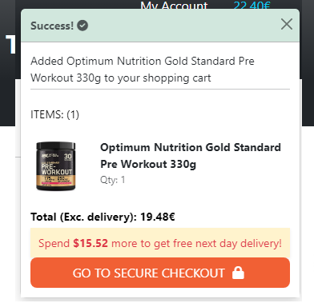 
 
[Back to top](<#contents>)

  ### Checkout Page
User is able to input their data for delivery securly and make payment through Stripe widget. Also check the order summary before purchase

  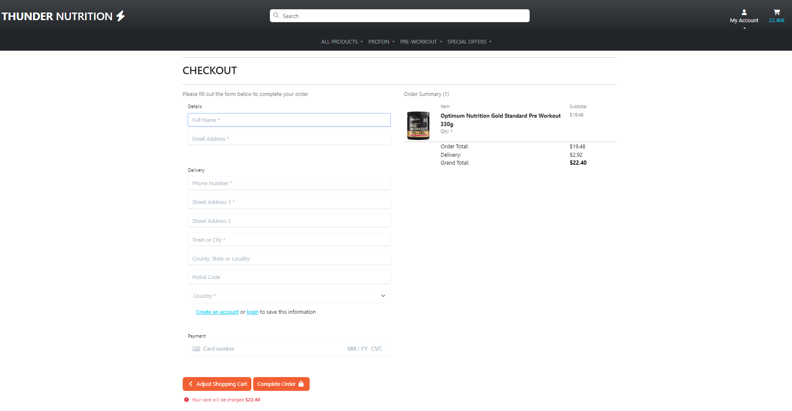 
 
[Back to top](<#contents>)

  ### Checkout Success
Once payment is success user will see a order summary.

  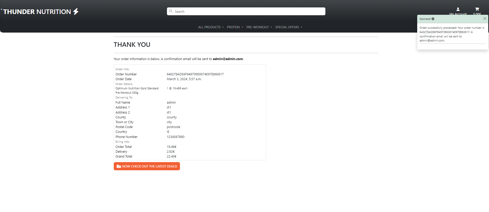 
 
[Back to top](<#contents>)

  ### Add Product
Administrator or Staff is able to add a product

  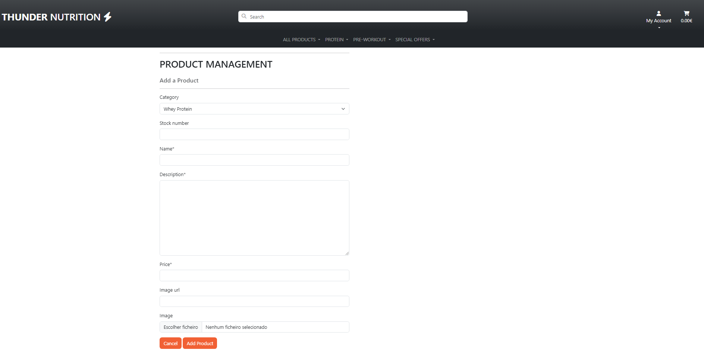
   
[Back to top](<#contents>)

  ### Edit Products
As administrator or Staff they can access the edit product page and edit the products

  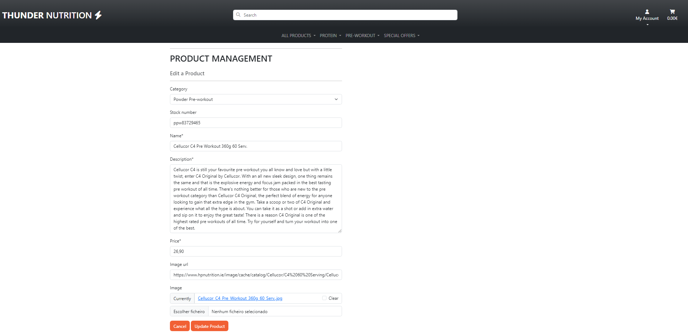

[Back to top](<#contents>)

  ### Profile Page
Here user is able to edit his delivery details as well as check order history

  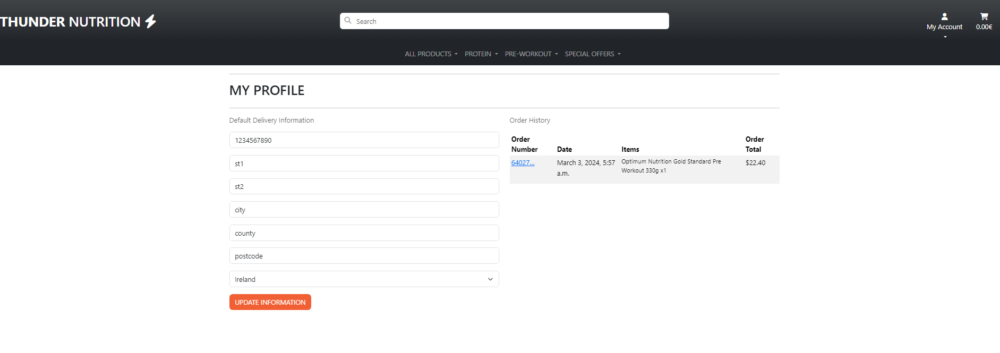

[Back to top](<#contents>)

  ### Future Features
For future features I will definetly implement a favorites page where user could add to favorites, also some sort of banners for advertisement to get sponsored ads on the website. 

[Back to top](<#contents>)

## Testing

| Test                | Action                   | Success Criteria  |
  | -------------       |-------------             | -----|
  | Landingpage loads      | Navigate to website URL  | Page loads < 5s, no errors |
  | Links            | Click on each Navigation link  | Correct section is redirected action performed |
  | Athentications System  | User should be able Sign Up Log In and Log Out | All functions working fine as expected |
  | CRUD Functionality  | User should be able to create edit and delete orders | All functions working fine as expected |
  | Responsiveness | Resize the viewport window from 320px upwards with Chrome Dev Tools. Use Responsive Design Checker to test various mobile, tablet, and large screen sizes | Page layout remains intact and adapts to screen size|
  | Different web browsers | Runned the app in Google Chrome, Mozilla Firefox and Internet Explorer | App works responsive and layout remains intact no errors or bug detected |
  | Different screen devices | Runned the app using a Samsung Galaxy s20 and Iphone 13 | App works responsive and layout remains intact no errors or bug detected |

[Back to top](<#contents>)

  
HTML Checkers

    - [**Home**](https://validator.w3.org/nu/?doc=https%3A%2F%2Fthunder-nutrition-6bac86cc4153.herokuapp.com%2F)
    - [**Products**](https://validator.w3.org/nu/?doc=https%3A%2F%2Fthunder-nutrition-6bac86cc4153.herokuapp.com%2Fproducts%2F)
    - [**Products Details**](https://validator.w3.org/nu/?doc=https%3A%2F%2Fthunder-nutrition-6bac86cc4153.herokuapp.com%2Fproducts%2F4%2F)
    - [**Product Edit**](https://validator.w3.org/nu/?doc=https%3A%2F%2Fthunder-nutrition-6bac86cc4153.herokuapp.com%2Fproducts%2Fedit%2F26%2F)
    - [**Product Add**](https://validator.w3.org/nu/?doc=https%3A%2F%2Fthunder-nutrition-6bac86cc4153.herokuapp.com%2Fproducts%2Fadd%2F)
    - [**Profiles**](https://validator.w3.org/nu/?doc=https%3A%2F%2Fthunder-nutrition-6bac86cc4153.herokuapp.com%2Fprofiles%2F)
    - [**My Favourites**](https://validator.w3.org/nu/?doc=https%3A%2F%2Fthunder-nutrition-6bac86cc4153.herokuapp.com%2Fmy_favourites%2Fview_my_favourites%2F)
    - [**Shopping Cart**](https://validator.w3.org/nu/?doc=https%3A%2F%2Fthunder-nutrition-6bac86cc4153.herokuapp.com%2Fshopping_cart%2F)
    - [**Checkout**](https://validator.w3.org/nu/?doc=https%3A%2F%2Fthunder-nutrition-6bac86cc4153.herokuapp.com%2Fcheckout%2F)
    - [**Checkout Success**](https://validator.w3.org/nu/?doc=https%3A%2F%2Fthunder-nutrition-6bac86cc4153.herokuapp.com%2Fcheckout%2Fcheckout_success%2FFEC00E06291F4C069F99A1A1C5796C18)
    - [**Contact**](https://validator.w3.org/nu/?doc=https%3A%2F%2Fthunder-nutrition-6bac86cc4153.herokuapp.com%2Fcontact%2F)

- All HTML files were passed through the W3C validator with no errors
- All JavaScript files were passed through JSHint with no errors present.
- The website was tested on major browsers including Chrome, Safari, Firefox and Edge.
- All user flows were tested in depth including navigating through the purchase flow, clicking CTAs and links, and form submission.
- All forms were tested to ensure validation was present and that forms could be submitted without error
- Lighthouse was used to test for Performance, Accessibility, Best Practices and SEO and adjustments were made to improve test results.

[Back to top](<#contents>)

 ### Bugs and Issues

Through the development accidentally some of the keys were pushed to github but they were all re-generated and add to the environ on heroku app.

[Back to top](<#contents>)

___

## Technologies Used
I used the following technologies, platforms and support in building my project:
- The application was built in Python.
- The [**Code Institute**](https://codeinstitute.net/) modules/lessons aided my learning and many of the concepts learned were applied in this project.
- [**GitHub**](https://github.com/Cesargarciajr/) was used for the project repository.
- [**Code Anywhere**](https://app.codeanywhere.com/) - for IDE and editor of the code.
- [**Django**](https://www.djangoproject.com/) - framework to develop the app and a few other libraries such as athentications system "Allauth" all specified in the requirements.txt file
- [**Bootstrap**](https://getbootstrap.com/) - for design and choices.
- [**Heroku**](https://www.heroku.com/platform) - was used for application deployment.
- [**Elephant SQL**](https://www.elephantsql.com/) - for database.
- [**Lucid**](https://lucid.co/) - Flowchart used on readme file.

[Back to top](<#contents>)

## Deployment

GitHub Deployment

First of all you need to have a GitHub account and I choose it because it's free and easy to create a repository to host your code and share with others.

- To create a repository you just need to go to the main page at the top right you will see a "+" button just click here and then new repository

- Select the name of the project and a description make it public and then create a repository

- Once you created your repository go the settings section and then click on pages

- Select the Branch as main and then save it.

- Finally, your repository is deployed and it should show you a link so you can share it with others.

Cloning the Repo

1. Click on the "Code" button near the top right corner of the page.
2. Copy the HTTPS or SSH URL that appears in the box.
Open your terminal (or Git Bash on Windows) and navigate to the directory where you want to clone the repository.
3. Type "git clone" followed by a space, and then paste the URL you copied in step 3.
4. Press enter to run the command. This will clone the repository onto your local machine.
5. You should now have a local copy of the GitHub repository on your machine.

Forking the Repo

1. Click the "Fork" button near the top right corner of the page. This will create a copy of the repository in your own GitHub account.
2. Once the fork is complete, you will be redirected to the forked repository in your account.
3. If you haven't already, clone the forked repository to your local machine using the steps outlined in the previous answer.
4. Make any changes or additions you want to the code in your local copy of the repository.
5. Commit your changes to your local repository using the "git commit" command.
6. Push your changes to the forked repository on GitHub using the "git push" command.
7. If you want to contribute your changes back to the original repository, create a pull request by going to the original repository's page and clicking the "New pull request" button. From there, you can compare your changes to the original repository and request that they be merged.
8. You should now have a forked copy of the GitHub repository in your account, and you can make changes to it and contribute back to the original repository if desired.

 

Heroku Deployment

1. First of all you need to have a Heroku account.
2. From the Dashboard, click "New" - "Create new app".
3. Enter a name for the app. Click "Create App".
4. Connect your GitHub account and select the repository and branch to deploy.
5. When you create the app, you will need to add two buildpacks from the Settings tab. The ordering is as follows:
    - heroku/python
    - heroku/nodejs
6. You must then create the followinf Config Varw:
   - PORT. Set this to 8000.
   - DATABASE_URL. Set this to your database url.
   - DISABLE_STATICFILES. Set to 0.
   - SECRET_KEY. Set to your secret key.

[Back to top](<#contents>)

## Credits

  ### Content  
  - [**Code Institute**](https://codeinstitute.net/)  - Tutor Support.
  - [**Code Institute Python Template**](https://github.com/Code-Institute-Org/python-essentials-template) - Template for Python mock terminal in Heroku.
  - [**GitHub**](https://github.com/) - for deployment and host.
  - [**Code Anywhere**](https://app.codeanywhere.com/) - for IDE and editor of the code.
  - [**W3 Schools**](https://www.w3schools.com/) - used for multiples researches and tutorials in HTML and CSS.
  - [**Stack Overflow**](https://stackoverflow.com) - used to clarify questions and collect answers.
  - [**Real Python**](https://realpython.com/python-pep8) - Also provide with clarity the solutions

 
[Back to top](<#contents>)

  ### Media
- [**Lucid**](https://lucid.co/) - Flowchart used on readme file.
- [**Bootstrap**](https://getbootstrap.com/) - for design and choices.

[Back to top](<#contents>)

## Acknowledgments
This project taught me a lot and helped me put in practice what I have learn throughout the Course specially getting to know more about Django frameworks and libraries. I was happy enough with the results and to be able to develop a real world application for a friend that will use it as a tool to better manage his business. I Thank the opportunity and help I got from all Code Institute Tutors, but special thanks to Tutors that helped me a lot troubleshooting and explaining to me my questions.

by [**Cesar Garcia**](https://github.com/Cesargarciajr)

# THANK YOU!

[Back to top](<#contents>)
